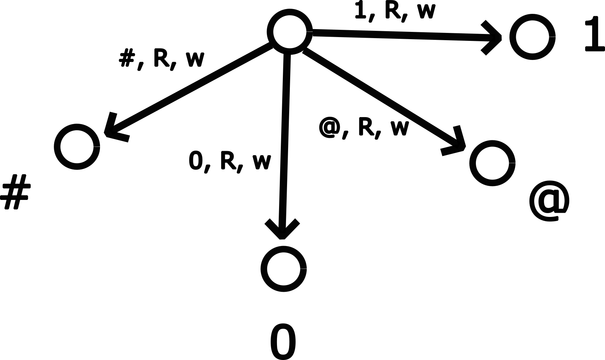

# Universal Turing Machine

This repository contains an implementation of a Universal Turing Machine (UTM), along with Python utilities for working with and transforming Turing Machines. A UTM is a Turing Machine that takes as input a description of another Turing Machine and simulates that Turing Machine. The existance of a UTM is important in computability theory and underpins the programmable nature of nearly all computer implementations.

## Overview
As a project in my Computability & Logic class, my goal was to create a UTM that can run on [this Turing Machine Simulator](https://github.com/ErikUmble/turing-machine/blob/main/TuringMachine4.zip). To achieve this goal quickly, without spending many hours debugging Turing Machines (TMs) in the GUI simulator, I developed the toolset in this repository which enable designing TMs in a high-level representation and testing parts of the algorithm modularly. This repository provides:

- A core Turing Machine (`TM`) class that supports arbitrary symbols and states
- An XML parser for loading and storing Turing Machines for use in the GUI simulator and in Python
- Compilation transformations (e.g., converting multi-symbol Turing Machines to binary-symbol machines)
- A UTM implementation that can simulate other Turing Machines

## Input Format & Assumptions
We can represent an arbitrary TM with a binary string of the following format:
$$𝑎_{1,0}0𝑞_{1,0}0 𝑎_{1,1}0 𝑞_{1,1}  0…0𝑎_{𝑛,1}0 𝑞_{𝑛,1}$$
where $a_{i,j}$ and $q_{i,j}$ specify the action to take and the next state to transition to, respectively, while in state i and when j is read on the tape. We use the following convention for specifying the action:
- '1': write 0
- '11':   write 1
- '111':  move left
- '1111': move right

And we use the number convention '1': 0, '11': 1, '111': 2, ... for the $q$ values to specify the state index to go to next. As input to the UTM, we use this representation, and also specify the number of states and the initial tape contents with the following format:
$$n0𝑎_{1,0}0𝑞_{1,0}0 𝑎_{1,1}0 𝑞_{1,1}  0…0𝑎_{𝑛,1}0 𝑞_{𝑛,1}0T$$
where n is the number of states and T is the tape contents (which may contain nonconsecutive '0's).

This implementation makes the following assumptions about the simulation target machine (none of which reduce the computational power of the simulated TM):
- Quadruple transitions (each transition either moves or writes a symbol, but not both)
- Simulated tape is right-sided infinite (current UTM will halt the program if it moves left of starting position)
- '00' marks the end of input and final result on the tape
- Start state: 1
- Halt state: 0
- Transitions are defined for the symbols '0' and '1' for all states except the halt state

Below is an example TM with its corresponding input.


## Universal Turing Machine Implementation

The UTM implementation divides the infinite tape into three regions:

1. **Counter**: Used to store and count state indices during simulation
2. **State Descriptions**: Contains encodings of all transitions for the simulated machine
3. **User Tape**: Contains the actual data being manipulated by the simulated machine

Each region is separated by a '#' symbol, and each contains an '@' symbol to mark the "read head" position for that region.


The UTM works by:
1. Read the current symbol from the user tape
2. Take an action based on the respective transition for the current state in the state descriptions
3. Update the counter to hold the next state index
4. Reset the state description read head and use the counter to move it to the next state's description
5. Continuing the simulation loop

## Symbol Reduction: 4-to-2 Symbol Compilation

The Turing Machine Simulator does not natively support symbols other than '0' and '1' on the tape. Our solution is to use every two cells on the tape to encode the 4 symbols ('0', '1', '#', '@'). It is always possible to use states and transitions that act on just '0's and '1's to perform the same behavior as a TM that supports more symbols, as shown in the following diagrams.


The above set of transitions can be represented on the encoded tape by:

Each state in the original machine expands to multiple states in the binary machine to handle the encoding.

We represent the two-cell symbols with the following convention:
   - '0' → '01'
   - '1' → '11'
   - '#' → '00'
   - '@' → '10'
   
(it is convenient to avoid consecutive '0's while encoding and decoding, hence why we choose '01' for the symbol '0')

One key utility of this repository is the ability to transform a Turing Machine using 4 symbols ('0', '1', '#', '@') into an equivalent machine using only binary symbols ('0', '1') using a compilation pass. This enables our UTM algorithm to work in 4-symbol space using the following procedure:

1. Encode each symbol from the original input as a 2-bit sequence
2. Run the core UTM algorithm that has been compiled from 4 symbols to 2
3. Clean the final tape, decoding the '0' and '1' symbols of the result

## Usage
You can run the UTM in the GUI simulator, or via the CLI programs provided in this repository.
### GUI
Unzip [TuringMachine4.zip](https://github.com/ErikUmble/turing-machine/blob/main/TuringMachine4.zip) and run the `TuringMachine4.jar` file.

Click File -> Open -> select `utm.xml` from this repository

Reset machine, load input onto tape, change speed to 'Compute', and click 'Start'.

### CLI
You can run any TM with the following:
```bash
python tm.py <machine xml filepath> <initial tape>
```
for example
```bash
python tm.py examples/add_tm.xml 11110111
```

There is also a shortcut for using the UTM:
```bash
python utm.py <input>
```
for example, the following runs the UTM on the adder TM with initial tape specifying to add 3+2 (using the 1-indexed standard representation specified above).
```bash
python utm.py 111111011011101111011011101111011110111011101111101011110111011111101011111011110101110111111011110111
```

### Constructing Inputs
To get the UTM input representation for a TM and initial tape, use
```bash
python utm_input.py <machine xml filepath> <initial tape>
```
for example, I used the following to generate the above input
```bash
python utm_input.py examples/add_tm.xml 11110111
```


## Future Enhancements

- Support for two-way infinite simulated tape (can be implemented by shifting the user tape right when moving "out of bounds" on the left)
- Better layout of the UTM states in GUI (could group states that were compiled from the same high-level state)
- Better support for composing multiple TMs into a single algorithm (similar to the SuperTransition idea, but a more general subroutine abstraction)
- Implement support for more symbols in the GUI simulator, or integrate these compilation tools into the GUI


## Acknowledgements

- Thank you Professor Bram for the fun course and for the software tools to practice and explore concepts in computability and logic.